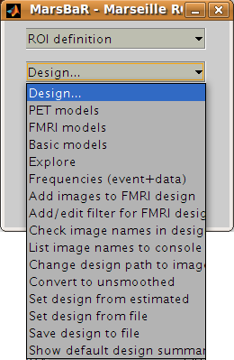
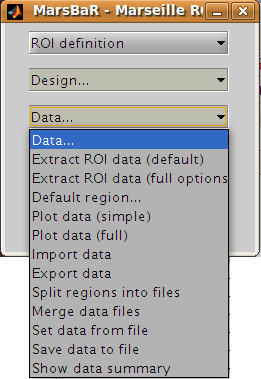

Running the ROI analysis
------------------------

First, let us estimate the activation within the ROI for the first run. There
are three stages to the analysis:

#. Choosing the design
#. Extracting the data
#. Estimating the design model with the data

The preprocessing for the example data created an SPM model for all three EPI
runs, so we already have a design made for the first run. We are going to use
this design and the ``trim_stim`` ROI to extract ROI data from the functional
scans. Then we will use the design and the extracted data to estimate the
model.

Stage 1: choosing the design
````````````````````````````

Click on the Design button in the MarsBaR window. You should get a menu like
this:



.. admonition:: Interface summary - design menu
   :class: interfacenote note

   The design menu offers options for creating, reviewing, estimating and
   processing SPM / MarsBaR designs.

   Oddly, let us start at the end: 

   Show default design summary
      Displays a summary of the currently loaded design in the SPM graphics window
   Set design from file
      will ask for a design file, and load the specified design into
      MarsBaR. The loaded design then becomes the default
      design. MarsBaR will from now on assume that you want to work with
      this design, unless you tell it otherwise by loading a different
      design.
   Save design to file
      will save the current default design to a file.
   Set design from estimated
      as we will see later, when MarsBaR estimates a design, it stores
      the estimated design in memory. Sometimes it is useful to take
      this estimated design and set it to be the default design, in
      order to be able to use the various of these menu options to
      review the design.

   Now, from the top of the menu:

   PET models, FMRI models, and Basic models 
      will use the SPM design routines to make a design, and store it in
      memory as the default design.
   Explore
      runs the SPM interface for reviewing and exploring designs.
   Frequencies (event+data)
      can be useful for FMRI designs. The option gives a plot of the
      frequencies present in ROI data and the design regressors for a
      particular FMRI event. This allows you to choose a high-pass
      filter that will not remove much of the frequencies in the design,
      but will remove low frequencies in the data, which are usually
      dominated by noise.
   Add images to FMRI design
      allows you to specify images for an FMRI design that does not yet
      contain images. SPM and MarsBaR can create FMRI designs without
      images. If you want to extract data using the design (see below),
      you may want to add images to the design using this menu item.
   Add/edit filter for FMRI design
      gives menu options for specifying high pass and possibly (SPM99)
      low-pass filters, as well as autocorrelation options (SPM2 and later).
   Check images in the design
      looks for the images names in a design, and simply checks if they
      exist on the disk, printing out a message on the matlab console
      window. A common problem in using saved SPM designs is that the
      images specified in the design have since moved or deleted; this
      option is a useful check to see it that has occurred.
   Change path to images
      allows you to change the path of the image filenames saved in the
      SPM design, to deal with the situation when images have moved
      since the design was saved.
   Convert to unsmoothed
      takes the image names in a design, and changes them so that they
      refer to the unsmoothed version of the same images – in fact it
      just removes the “s” prefix from the filenames. This can be useful
      when you want to use an SPM design that was originally run on
      smoothed images, but your ROI is very precise, so you want to
      avoid running the ROI analysis on smoothed data, which will blur
      unwanted signal into your ROI.

If you have been reading the interface summary, welcome back. Isn't it strange
how time just seems to stop when you are reading about graphical user
interfaces?

Our plan was to choose our design. Select the Set design from file
option in the design menu and choose the ``SPM.mat`` file in the
``sess1/SPM8_ana`` directory.  MarsBaR loads the design into memory and
displays the design matrix in the SPM graphics window.

Stage 2: extracting the data
````````````````````````````

Before we can run the model, we need to extract the ROI data from the
functional scans. This brings us to the data menu:



We are going to choose *Extract ROI data(default)*, and for simple analyses this
may be all you will ever need. For those with a thirst for knowledge, here is
the:

.. admonition:: Interface summary - data menu
   :class: interfacenote note

   Extract ROI data (default)
      takes one or more ROI files and a design, and extracts the data
      within the ROI(s) for all the images in the design. As for the
      default design, MarsBaR stores the data in memory for further use.
   Extract ROI data (full options)
      allows you to specify any set of images to extract data from, and
      will give you a full range of image scaling options for extracting
      the data.
   Default region...
      is useful when you have extracted data for more than one ROI.  In
      this case you may want to restrict the plotting functions (below)
      to look only at one of these regions; you can set which region to
      use with this option.  If you do not specify, MarsBaR will assume
      you want to look at all regions.
   Plot data (simple)
      draws time course plots of the ROI data to the SPM graphics
      window. Plot data (full) has options for filtering the data with
      the SPM design filter before plotting, and for other types of
      plots, such as Frequency plots or plots of autocorrelation
      coefficients.
   Import data
      allows you to import data for analysis from matlab, text files or
      spreadsheets. With Export data you can export data to matlab
      variables, text files or spreadsheets.
   Split regions into files
      is useful in the situation where you have extracted data from more
      than one ROI, but you want to estimate with the data from only one
      of these ROIs. This can be a good idea for SPM2 (and later)
      designs, because, like SPM2 (and later), MarsBaR will pool the
      data from all ROIs when calculating autocorrelation. This may not
      be valid, as different brain regions can have different levels of
      autocorrelation. Split regions into files takes the current set of
      data and saves the data for each ROI as a separate MarsBaR data
      file.
   Merge data files 
      reverses the process of *Split files* above, by taking a series of
      ROI data files and making them into one set of data with many
      ROIs.
   Set data from file 
      will ask for a MarsBaR data file (default suffix ``_mdata.mat``) and
      load it into memory as the current set of data. 
   Save data to file
      will save the current set of data to a MarsBaR data file.
   Show data summary
      outputs some summary text to the SPM graphics window

Again, welcome back to our linear readers. For the tutorial, we want to
extract the data for our ROI, from the images in our design. Choose
*Extract ROI data(default)*; the GUI will ask you to select one or more
ROIs files; select the ``trim_stim_roi.mat`` file. MarsBaR starts to
whirr. As it whirrs, it will:

#. Take each image in the design (you had already set the default design
   from the design menu);
#. Extract all the data within the ROI for each image, to give voxel time
   courses for each voxel in the ROI.

When it has finished, MarsBaR will calculate a new summary time course for each
ROI. The summary time course has one value per scan, per ROI; by default,
this new time course is made up of the means of all the voxel values in the
ROI. For example, if there are only 5 voxels in the ROI, the first value in
the summary time series will be the mean of the 5 voxel values for scan 1, the
second value will be the mean of the 5 voxel values for scan 2, and so on. 
You can change the method of summarizing voxel data using the Statistics, Data
summary function item in the MarsBaR options interface.

.. admonition:: Technical note - the summary function
   :class: technote note

   There are many ways to use ROI data, but the simplest approach, used by
   MarsBaR, is to treat the voxel values within the region of an image as many
   samples of the same signal. So, for each image, we find the voxels that are
   within the ROI, and calculate a single summary value to represent all the
   voxels in the ROI. This gives us one ROI summary value per image, and we can
   run the statistical model on this time-course of summary values.

   The most obvious way of summarizing the values within the ROI is to
   take the mean. This is the default in MarsBaR. The mean can be
   greatly affected by outliers. If we suspect there may be outlier
   voxels in the ROI, the median may be more robust as a summary
   function. The other option offered as a summary function is the
   weighted mean. Usually ROIs are binary – meaning that they contain
   ones within the ROI and zeros elsewhere. In this case the weighted
   mean will be identical to the mean. However, it is possible to define
   ROIs which contain weighting values, where high values represent high
   confidence that this voxel is within the region of interest, and
   values near zero represent low confidence. In this situation, it can
   be useful to use the ROI values to weight the mean value.

   Earlier versions of MarsBaR also offered the option of taking the
   first eigenvector of the signal.  We removed it for version 0.42
   because it seemed as if it was replicating the behavior of the SPM
   VOI routines - but it was not.

As MarsBaR extracts the data you will see its progress printed to the matlab
console. When the extraction is done, the data is kept in memory. You can
save the data to disk if you want using the Save data to file option on the
data menu.

Now we have the design and the data we can estimate the model.

Stage 3: estimating the model
`````````````````````````````

As the sweat pours from your brow, you click on the Results menu in the
MarsBaR window. Scarcely believing it could be this easy, you choose the
first item on the menu, *Estimate results*. It was that easy! MarsBaR
takes the default design and the extracted data, and runs the
model. There are more progress reports to the matlab console; finally
you see the suggestion that you use the results section for assessment.

