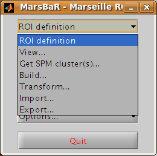
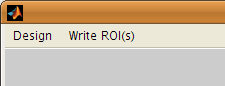
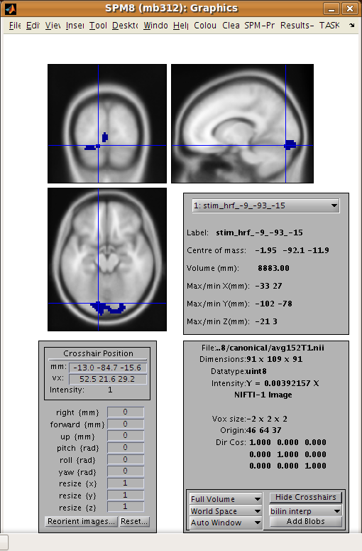
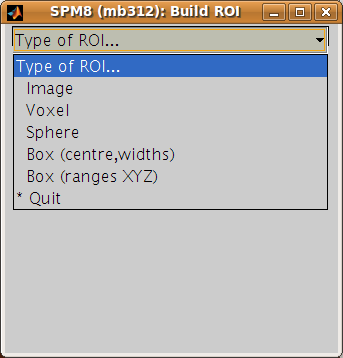

=========================
 Defining and using ROIs
=========================

The preprocessing script has already run an SPM model for run 2 (and run 1 and
run 3). Now we need to find an activation cluster in the visual cortex.

Go to the MarsBaR window, and click on ROI definition. You should get a menu
like this:



.. admonition:: Interface summary - the ROI definition menu
     :class: interfacenote note

     View
        displays one or ROIs on a structural image.
     Draw
        calls up a Matlab interface for drawing ROIs.
     Get SPM cluster(s)
        uses the SPM results interface to select and save activation
        clusters as ROIs.
     Build 
        gives an interface to various methods for defining ROIs, using
        shapes (boxes, spheres), activation clusters, and binary images.
     Transform
        offers a GUI for combining ROIs, and for flipping the orientation
        of an ROI to the right or left side of the brain.
     Import
        allows you to import all SPM activations as ROIs, or to import ROIs
        from cluster images, such as those written by the SPM results
        interface, or from images where ROIs are defined by number labels
        (ROI 1 has value 1, ROI 2 has value 2, etc.). Similarly
     Export
        writes ROIs as images for use in other packages, such as MRIcro_.

Defining a functional ROI
-------------------------

We are going define the functional ROI using the SPM analysis for run 2. Select
*Get SPM cluster(s)...*: from the menu. This runs the standard SPM results
interface. Use the file selection window that SPM offers to navigate to the
``sess2/SPM8_ana`` directory. Select the SPM.mat file and click Done. Choose the
stim_hrf t contrast from the SPM contrast manager, click Done. Then accept all
the default answers from the interface, like this:

+-------------------------------+----------+
| Prompt                        | Response |
+===============================+==========+
| mask with other contrasts:    | no       |
+-------------------------------+----------+
| title for comparison          | stim_hrf |
+-------------------------------+----------+
| p value adjustment to control | none     |
+-------------------------------+----------+
| threshold {T or p value}      | 0.05     |
+-------------------------------+----------+
| & extent threshold {voxels}   | 0        |
+-------------------------------+----------+


.. admonition:: Technical note - MarsBaR and SPM designs
   :class: technote note

   For the large majority of tasks, MarsBaR can use SPM designs
   interchangeably.  For example, when running with SPM5, you can load
   SPM99 designs and estimate them in MarsBaR; you can also estimate
   SPM5 designs from MarsBaR, even if you are using - say -
   SPM99. However, MarsBaR uses the standard SPM routines for the 'Get
   SPM cluster(s)' routines. This means that if, for example, you are
   running SPM5 you can only get clusters from an SPM5 design and you
   can only get clusters from an SPM99 design if you are running SPM99.

Now you have run the *Get SPM cluster(s)* interface, you should have an SPM
activation map in the graphics window:

.. image:: fig/spm_run2.png

Meanwhile, you may have noticed there is a new menu in the SPM input window:



Another thing you may not have noticed is that the matlab working
directory has now changed to the ``sess2/SPM8_ana``. SPM does this to be
able to keep track of where its results files are.

Move the red arrow in the SPM graphics window to the activation cluster in the
visual cortex. You can do this by dragging the arrow, or right-clicking to the
right of the axial view and choosing goto global maxima.

When the red arrow is in the main cluster, click on the Write ROI(s) menu in
the SPM input window and select Write one cluster.

.. admonition:: Interface summary - Write ROI(s)
   :class: interfacenote note

   Write one cluster
      writes out a single cluster at the selected location.
   Write all clusters
      writes all clusters from the SPM map; MarsBaR will ask for a
      directory to save the files, and a root name for the ROI files
      before saving each ROI as a separate file.
   Rerun results UI
      restarts the SPM results interface as if you had clicked on the
      SPM results button; Clear clears the SPM graphics window.

After you have selected Write one cluster, MarsBaR asks for details to save
with the ROI, which are a description, and a label. Both provide information
about the ROI for statistical output and display. The label should be 20
characters or so, the description can be longer. For the moment, accept the
defaults, which derive from the coordinates of the voxel under the red arrow
and the title of the contrast:

+-------------------+-------------------------------------------+
|Prompt             |Response                                   |
+===================+===========================================+
|Description of ROI | ``stim_hrf`` cluster at [-9.0 -93.0 -15.0]|
+-------------------+-------------------------------------------+
|Label for ROI      | ``stim_hrf_-9_-93_-15``                   |
+-------------------+-------------------------------------------+

After this, MarsBaR offers a dialog box to give a filename for the
ROI. By default the offered filename will be
``stim_hrf_-9_-93_-15_roi.mat`` in the ``sess2/SPM8_ana`` directory. For
simplicity, why not accept the default name and click Save to save the
ROI.

.. admonition:: Technical note - ROIs and filenames
   :class: technote note

   MarsBaR stores each ROI in a separate file. In fact, the files are in
   the Matlab ``.mat`` format.  MarsBaR will accept any filename for the
   ROI, and can load ROIs from any file that you have saved them to, but
   it will suggest that you save the ROI with a filename that ends in
   ``_roi.mat``. This is just for convenience, so that when you are asked to
   select ROIs, the MarsBaR GUI can assume that ROI files end with this
   suffix. It will probably make your life easier if you keep to this
   convention.

Review the ROI
--------------

We can now review this ROI to check if it is a good definition of the visual
cortex. Click on the ROI definition menu in the MarsBaR window, and select
View…. Choose the ROI and click Done. Your ROI should be displayed in blue on
an average structural image:



.. admonition:: Interface summary - the view utility
   :class: interfacenote note

   The view utility allows you to click around the image to review the
   ROI in the standard orthogonal views. You can select multiple ROIs to
   view on the same structural. The list box to the left of the axial
   view allows you to move to a particular ROI (if you have more than
   one). When the cross-hairs are in the ROI, the information panel will
   show details for that ROI, such as centre of mass, and volume in
   mm. The default structural image is the MNI 152 T1 average brain; you
   can choose any image to display ROIs on by clicking on the
   Options... menu in the MarsBaR window, then choosing Edit Options...,
   followed by Default structural.

Refining the ROI
----------------

Now we have reviewed the ROI, we see that the cluster does include
visual cortex, but there also seems to be some connected activation
lateral and inferior to the primary visual cortex. The cross-hairs in
the figure are at something like the border between primary visual
cortex and more lateral voxels. Ideally we would like to restrict the
ROI to voxels in the primary visual cortex.

We can do this by defining a box ROI that covers the area we are interested in,
and combining this with the activation cluster.

Defining a box ROI
``````````````````

To decide on the box dimensions, click around the ROI in the view interface and
note the coordinates of the cross-hairs that are shown at the top of the bottom
left panel. This may suggest to you, as it did to us, that it would be good to
restrict the ROI to between -20 and +20mm in X, -66 to -106mm in Y, and -20 to
+7mm in Z.

To define this box ROI, click on ROI definition, and choose Build..., . You
will see a new menu in the SPM input window:



From the menu, select Box (ranges XYZ). Answer the prompts like this:

+---------------------+-------------------------------------------------+
| Prompt              | Response                                        |
+=====================+=================================================+
| [2] Range in X (mm) | -20 20                                          |
+---------------------+-------------------------------------------------+
| [2] Range in Y (mm) | -66 -106                                        |
+---------------------+-------------------------------------------------+
| [2] Range in Z (mm) | -20 7                                           |
+---------------------+-------------------------------------------------+
| Description of ROI  | box at -20.0>X<20.0 -106.0>Y<-66.0 -20.0>Z<7.0  |
+---------------------+-------------------------------------------------+
| Label for ROI       | ``box_x_-20:20_y_-106:-66_z_-20:7``             |
+---------------------+-------------------------------------------------+
| Filename            | ``box_x_-20_20_y_-106_-66_z_-20_7_roi.mat``     |
+---------------------+-------------------------------------------------+


The last three values here are the defaults.

To check this is as you want it, choose ROI Definition, View, select
both of ``box_x_-20_20_y_-106_-66_z_-20_7_roi.mat`` and
``stim_hrf_-9_-93_-12_roi.mat``, in that order, and click Done. You
should see the box in blue, with the activation cluster overlaid in red.

We now need to combine the two ROIs, to select only those voxels that are
shared by the box and the activation cluster.

Combining ROIs
``````````````

Choose ROI Definition, Transform... A new menu comes up in the SPM input
window. Choose Combine ROIs; select both the box and the cluster ROIs, click
on Done. The prompt now asks for a function with which to combine the ROIs.
In this function, the first ROI you selected is r1, and the second ROI is r2.
Here we want to get the overlap, and this is represented by the logical AND
operator, which is ``&`` in Matlab. Enter the function ``r1 & r2``.

.. admonition:: Technical note - combining ROIs 
   :class: technote note

   You can use most mathematical functions to combine ROIs. If you
   wanted to combine two ROIs, so the new ROI has all the voxels in ROI
   1 and all the voxels in ROI2, you could use the function ``r1 | r2``
   (read as "r1 or r2"). If you wanted only the voxels in ROI 1 that are
   not in ROI 2: ``r1 & ~ r2``. Similarly, you can choose more than two
   ROIs and combine them. The function ``(r1 & r2) & ~r3`` gives all the
   voxels in ROI 1 and ROI 2, but excluding those that are in ROI 3.

After this, accept the default description, set the label to something like
“Trimmed stim run 2”, and save the ROI as ``trim_stim_roi.mat``.

Writing the ROI as an image
---------------------------

Just for practice, let us write our new ROI as a binary image. You might want
to do this so you can review the ROI using another program, such as the
excellent MRIcro_. Click on ROI definition, then Export....
Select image from the new menu in the SPM input window, and choose the new
trim_stim_roi.mat as the ROI to export. Another menu appears, asking for a
Space for ROI image. The three options are Base space for ROIs, From image, or
ROI native space.

.. admonition:: Technical note - ROIs and image spaces
   :class: technote note

   An ROI can be one of two fundamental types: a shape (such as a box or
   sphere) or a list of points (such as an activation cluster or
   coordinates read in from an ROI in an image). Shape ROIs know nothing
   about such vulgarities as voxels, they are abstract concepts waiting
   to be applied. In order to display shapes, or write them to images,
   or combine them with other ROIs, we need to convert them to point
   lists in a certain space – with dimensions in X Y and Z, and voxels
   with specified sizes. For example, when MarsBaR combines ROIs, it
   needs some default space (dimensions, voxel sizes) in which to define
   the new point list ROI. By default, this is the space of the MNI
   template; so the Base space for ROIs in the menu above will be MNI
   space. This is a good space to use if you are working with spatially
   normalized data, but ROIs are often defined on a subject's data
   before spatial normalization. In this case, it may be more useful to
   set the ROI base space to match the subject's own activation images,
   using Options, Edit options from the MarsBaR window.

   The issue of the ROI space comes up here, because we need to define
   what dimensions and voxels we should use when writing the image. We
   can either write the image using the Base space, or we can use some
   arbitrary space defined by an image, or we can get the space directly
   from the ROI. Here, the ROI is an activation cluster, and the native
   ROI space for an activation cluster uses the minimum dimensions
   necessary to hold all the voxels in the ROI. An ROI image for this
   cluster using native space uses minimum disk storage, but does not
   give a good impression of the ROI location when displayed in, for
   example, MRIcro_.

In our case, the data are spatially normalized, and so are in the space of the
MNI template. The MNI template space is the default base space for ROIs, so
select Base space for ROIs, choose a directory to save the image, and accept
the default filename for the image, which should be trim_stim. You can check
this has worked, by finding the SPM buttons window, selecting Display, and
choosing the new trim_stim.img.

.. include:: ../links_names.txt
