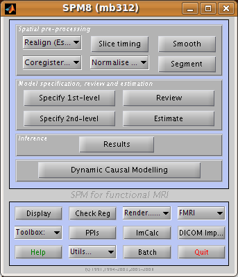
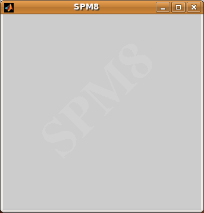
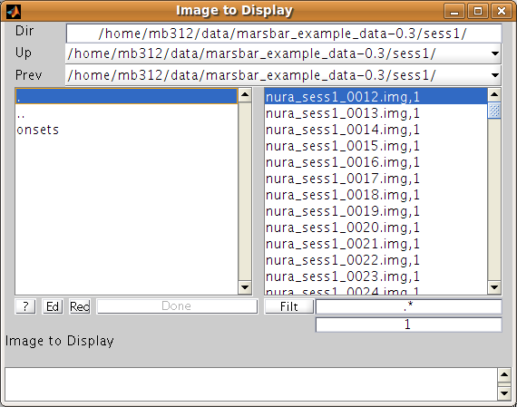

The MarsBaR / SPM interface
---------------------------

Let's begin by naming the windows used by SPM and MarsBaR. After you have
started SPM and MarsBaR, you should have the following set of windows:

The MarsBaR window:

Then, at the top left of the screen, the SPM buttons window

Underneath the SPM buttons window, at the bottom left of the screen, is the SPM input window: 

SPM and MarsBaR use this window to get input from you, gentle user, such as
text, numbers, or menu choices. Usually on the right hand side of the screen,
there is:

Figure 5: the file selection window

Figure 4: the SPM graphics window

.. image:: fig/spm_graphics.png

which is used to display results and other graphics. Finally, there is:

Figure 6: the file selection window

which SPM and MarsBaR use to collect file or directory names.

