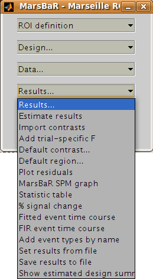
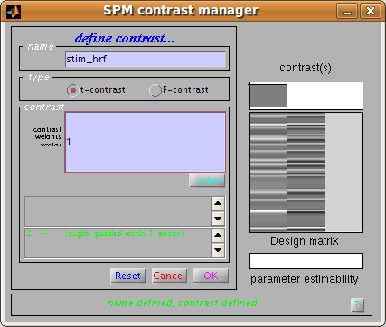

Basic results: the statistic table
----------------------------------

Let us start the assessment by getting some t and F values for the effects in
the design. Click on the Results button in the MarsBaR window:

.. admonition:: Interface summary - the results menu
   :class: interfacenote note

   Estimate results
      as we know, takes the default design, and the ROI data, and
      estimates the model. MarsBaR stores the estimated results in
      memory as the estimated design.
   Import contrasts
      gives an interface for you to select contrasts from other
      analyses, and import them into the list of contrasts for the
      current analysis.
   Add trial specific F
      will add F contrasts for each trial, and each session, if they are
      not already present.
   Default contrast
      will set one contrast as the default to use for other options on
      this menu, such as the MarsBaR SPM graph plotting function.
   Default region
      applies only if the current results are for more than one
      region. It will select one region from the data to use for
      analysis and plots.
   Plot residuals
      puts up various plots of the residual errors from the model, to
      check for violation of assumptions or major outliers.
   MarsBaR SPM graph
      uses the SPM plotting functions to plot contrasts of parameter
      estimates, fitted and adjusted responses, estimates of event or
      block related response, and so on.
   Statistic table
      shows various statistics for selected contrasts, as we will see in
      the tutorial.
   % signal change 
      will show an estimate for the percent signal change for a single
      event. There are many assumptions for this analysis; please treat
      it like you would treat your children: with a combination of great
      care and weary scepticism.
   Set results from file
      allows you to choose the results you want to review.  When you
      estimate a model in MarsBaR, the program will automatically set
      the new results to be current for the results menu. If you want to
      analyze some other set of MarsBaR results, you can use this option
      to select and load another analysis file. The default file suffix
      for MarsBaR estimated results is ``_mres.mat``.
   Save results to file
      will save the current estimated results, including the data used
      for the estimation, to a file on disk.

To continue with our analysis, we next need to specify a contrast. In
our case the contrast is very simple: just a 1 in the column for the HRF
regressor used to model the visual event. Usually the contrast will be
more complicated, and you may have already entered it for a previous SPM
or MarsBaR analysis. The Import contrasts option allows you to get
contrasts from a previous analysis.  To show how it works, click on this
option. The SPM file selection window should appear. Navigate to the
``sess1/SPM8_ana`` directory, and select the ``SPM.mat`` file there. The
SPM contrast manager comes up, showing all the F and t contrasts in the
``SPM.mat`` file. Select the ``stim_hrf`` t contrast, and click Done.
MarsBaR will put this contrast into the current estimated design. Here
we only selected one contrast, but you can select many contrasts by
dragging the mouse, shift clicking etc. (depending on your system).

Now click on the Statistic table option in the MarsBaR results menu. Select
the ``stim_hrf`` contrast and click Done. The results will print out in a rather
ugly fashion in the Matlab window. You might want to enlarge your Matlab
window to stop the text wrapping in an annoying way. Here is the output on my
machine:

::

   Contrast name   ROI name: Contrast value:    t statistic:  Uncorrected P:    Corrected P
   ----------------------------------------------------------------------------------------

   stim_hrf
   --------------------------

         trimmed stim run 2:           2.27:           4.84:       0.000002:       0.000002

At the left you see the contrast name. Under this, and to the right, MarsBaR
has printed the ROI label that you entered a while ago. The t statistic is
self explanatory, and the uncorrected p value is just the one-tailed p value
for this t statistic given the degrees of freedom for the analysis. The
corrected p is the uncorrected p value, with a Bonferroni correction for the
number of regions in the analysis. In this case, we only analyzed one region,
so the corrected p value is the same as the uncorrected p value. MarsBaR (like
SPM), will not attempt to correct the p value for the number of contrasts,
because the contrasts may not be orthogonal, and this will make a Bonferroni
correction too conservative.

There is also a column called *Contrast value*. For a t statistic, as here, this
value is an effect size. Remember that a t statistic consists of an effect
size, divided by the standard deviation of this effect. Here our contrast is
very simple, containing only a single 1, so the contrast value is the same as
the value of the first parameter in the model. The value of this parameter
will be the best-fitting slope of the line relating the height of the HRF
regressor to the FMRI signal. This effect size measure is the number that SPM
stores for each voxel in the ``con_0001.img``, ``con_0002.img`` ... series, and these
are the values that are used for standard second level / random effect
analyses.

Just for practice, let us also run an F contrast. Click Statistic table again,
choose the effects of interest contrast, click Done:

::

   Contrast name   ROI name:       Extra SS:    F statistic:  Uncorrected P:    Corrected P
   ----------------------------------------------------------------------------------------

   effects of interest
   --------------------------

         trimmed stim run 2:          41.15:          28.26:       0.000000:       0.000000

Now the Contrast value has become the *Extra SS*.  This is a measure of the
variance that would be added to a model that does not contain the effects in
the contrast.  The F statistic is this measure, adjusted for the number of
effects, and divided by the residual variance for the whole model. There is
no simple way of using this *Extra SS* value in second level analyses.

Comparing fast and slow events
------------------------------

Our results so far show that there is indeed a highly significant effect of
visual stimulation on the visual cortex, even for very frequent events. This
is not a Nature paper so far. To make things a bit more interesting, we can
compare this effect, from run 1, with the effect in run 3, for which the events
were much less frequent.

Click on Design in the MarsBaR window, then Set design from file. Choose
``SPM.mat`` from ``sess3/SPM8_ana``. Now we need to extract the data;
select *Extract ROI data (default)* from the data menu. MarsBaR will ask
you if you want to save the previous data. Why not say 'no' for the
moment. Next choose ``trim_stim_roi.mat`` again. When that is done, run
*Estimate results* from the Results menu. Again choose 'no' when asked if
you want to save the previous estimated design.

.. admonition:: Technical note - directories and saving results
   :class: technote note

   MarsBaR, unlike SPM, does not need a new directory for each new set of results.
   Designs, results and data are kept in memory until you save them, and you can
   save them with any filename. This means you can keep many sets of results in
   the same directory.

When the estimation has finished, click on Results, *Statistic
table*. Next you need to enter the HRF contrast. Earlier, we imported
the HRF column contrast from an SPM model. To save time, why not enter
this contrast directly using the contrast manager; it is just a t
statistic with a single 1 in the first column:

In the end, you get a new statistic table:

::

   Contrast name   ROI name: Contrast value:    t statistic:  Uncorrected P:    Corrected P
   ----------------------------------------------------------------------------------------

   stim_hrf
   --------------------------

         trimmed stim run 2:           3.15:           4.44:       0.000011:       0.000011

You can see that the contrast value – which is proportional to the change in
signal for a single event – is greater for run 3 than for run 1. Despite this,
the t statistic for run 3 is lower than for run 1. One explanation for this is
that there are many more events in run 1, so the estimate of signal change per
event is more reliable (has less variance).
